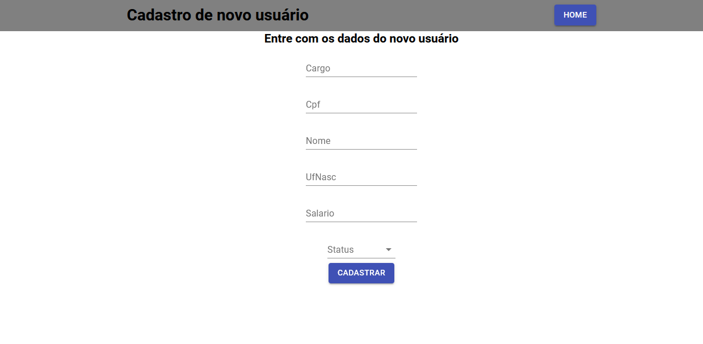

## Sobre

Projeto Frontend referente ao teste Web com ReactJS solicitado pela **Seidor**.

---

## Como baixar e iniciar o projeto

```bash
# Clonar o repositório
$ git clone https://github.com/RenatoRosseto/SeidorFrontend.git

# Entrar no diretório
$ cd SeidorFrontend

# Instalar as dependências
$ yarn install 

# Iniciar o projeto
$ yarn start

```
---

## Imagens do projeto

<h3>
  
</h3>

<h3>
  
</h3>